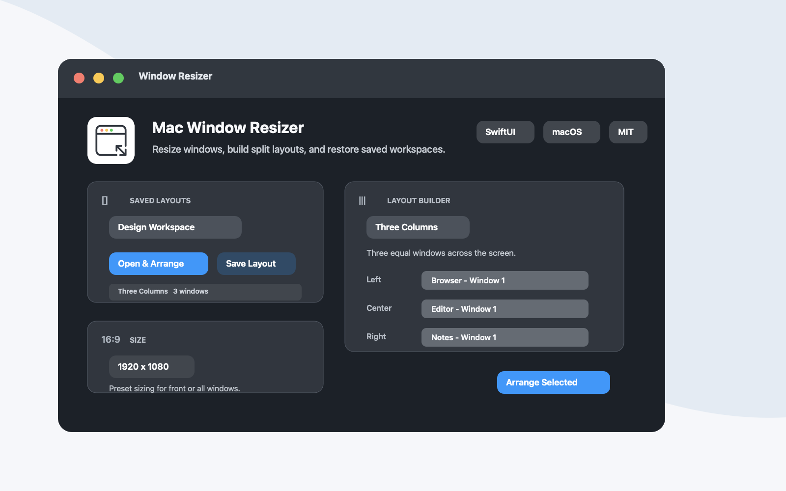

# Mac Window Resizer

Mac Window Resizer is a small macOS SwiftUI utility for resizing and arranging windows from other apps. It can resize the front window or all standard windows for a selected app, arrange selected windows into common layouts, and save layouts that reopen apps and restore their window positions.

<p align="center">
  
</p>

## Features

- Resize the frontmost window or every standard window for a selected app.
- Use presets for common sizes like 1080p, 720p, mobile, tablet, and square.
- Arrange selected windows into two-column, three-column, four-grid, and focus-stack layouts.
- Save custom layouts and reopen the matching apps later.
- Preserve local Accessibility permission across rebuilds with stable signing metadata.

## Requirements

- macOS 14 or newer
- Xcode command line tools
- Accessibility permission for Window Resizer

## App Icon

<p>
  
</p>

## Build and Run

```sh
./script/build_and_run.sh
```

The build script compiles the Swift source, generates the app icon, signs the app with a local signing identity, installs it at `/Applications/Window Resizer.app`, and opens it.

Use `--verify` to build, install, launch, and confirm the app starts:

```sh
./script/build_and_run.sh --verify
```

## Signing

The script keeps the bundle identifier, install path, and local signing requirement stable so macOS Accessibility permission survives local rebuilds. The local signing keychain is stored under `~/Library/Application Support/Window Resizer/CodeSigning` instead of this repository.

For a public release, replace the local signing identity with an Apple Developer ID Application certificate and notarize the app.

## Open Source

Mac Window Resizer is open source under the MIT License. See [LICENSE](LICENSE) for details.
