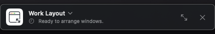
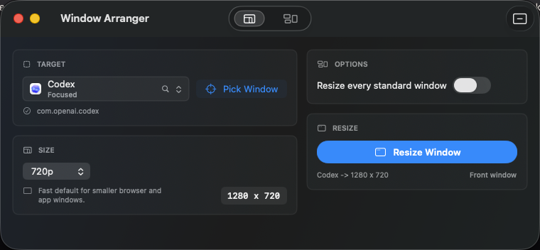

# Mac Window Arranger

Mac Window Arranger is a small native macOS SwiftUI utility for resizing and arranging windows from other apps. It starts as a compact Dock-adjacent Mini Mode control, expands into the full arranger when needed, and returns to Mini Mode after successful window actions.

<p align="center">
  
</p>

<p align="center">
  
</p>

<p align="center">
  
</p>

## Features

- Resize the frontmost window or every standard window for a selected app.
- Search running and installed apps from the resize target picker, prioritized by focused app, visible windows, running apps, then installed apps.
- Pick the resize target from the app picker, or use Pick Window to outline a hovered window and resize it on click.
- Fade foreground windows that overlap the highlighted picker target so the target remains readable.
- Use presets for common sizes like 1080p, 720p, mobile, tablet, and square.
- Arrange selected windows into two-column, three-column, four-grid, and focus-stack layouts.
- Save custom layouts and reopen the matching apps later with Open & Arrange.
- Keep Resize and Arrange modes separate so each workflow stays compact.
- Restore minimized saved-layout windows before arranging them.
- Start in Mini Mode, switch saved layouts from the compact control, and return to a small Dock-adjacent control after successful actions.
- Call the app from Shortcuts, scripts, launchers, or other macOS apps with the `window-arranger://` URL scheme.
- Check GitHub releases automatically, view latest release notes from the expanded toolbar, and download/open the latest DMG from inside the app.
- Preserve local Accessibility permission across rebuilds with stable signing metadata.

## Current Status

- Built as a local signed, hardened-runtime universal macOS app (`arm64` and `x86_64`).
- Installed by the build script at `/Applications/Window Arranger.app`.
- Privacy manifest is bundled at `Contents/Resources/PrivacyInfo.xcprivacy`.
- Direct-download builds include GitHub release update checks with a one-click DMG download/open flow.
- Planned public release: low-cost paid Mac App Store version, likely around $2 to $4, to support continued development.
- Current App Store blocker: App Sandbox is intentionally disabled because sandboxed builds cannot access other apps' windows through Accessibility. Developer ID signing plus notarization is the fallback path while that blocker is unresolved.

See [docs/STORE_SUBMISSION.md](docs/STORE_SUBMISSION.md) for distribution details and remaining release work.

## Source Layout

The app follows a small native macOS SwiftUI structure:

- `source/App`: app entry point, window delegate, and compact panel controller.
- `source/Views`: SwiftUI screens and reusable view components.
- `source/Stores`: observable UI state and user actions.
- `source/Services`: Accessibility, app launching, window discovery, and resize/arrange logic.
- `source/Models` and `source/Support`: data types and shared helpers.

## Requirements

- macOS 14 or newer
- Xcode command line tools
- Accessibility permission for Window Arranger
- Optional Screen Recording permission for the clearest picker overlap preview

On first use, grant Accessibility permission in System Settings so the app can read, move, unminimize, and resize windows owned by other apps. Screen Recording is only used during window picking to blend the highlighted window through overlapping foreground windows; without it, the picker falls back to a frosted overlap effect.

## Install

GitHub checkouts include a ready-made drag-to-Applications disk image at [`dist/Window Arranger.dmg`](dist/Window%20Arranger.dmg). Open the DMG, drag `Window Arranger.app` into `/Applications`, then grant Accessibility permission on first launch.

The bundled DMG is signed for local validation. Public direct-download releases should be rebuilt with a Developer ID Application certificate and notarized before distribution.

## Updates

Direct-download builds check the latest GitHub Release once per day and cache any available update. You can also use the expanded toolbar update icon, Help > Check for Updates, or `window-arranger://check-updates`. The expanded toolbar popover shows the installed version, latest release version, and GitHub release notes. When a newer release has a DMG asset, the in-app Download button saves it to Downloads and opens it.

Mac App Store builds should disable the GitHub update check and use Apple's App Store update flow.

## App Icon

<p>
  
</p>

## Build and Run

```sh
./script/build_and_run.sh
```

The build script compiles the Swift sources, generates the app icon, signs the app with a stable local signing identity, installs it at `/Applications/Window Arranger.app`, and opens it in Mini Mode.

Use `--verify` to build, install, launch, and confirm the app starts:

```sh
./script/build_and_run.sh --verify
```

Useful modes:

- `./script/build_and_run.sh --install`: build, install, and launch the app.
- `./script/build_and_run.sh --dmg`: build a signed drag-to-Applications DMG at `dist/Window Arranger.dmg`.
- `./script/build_and_run.sh --logs`: launch and stream process logs.
- `./script/build_and_run.sh --telemetry`: launch and stream app-subsystem logs.

## Automation

Other apps, Shortcuts, launchers, and shell scripts can call Window Arranger through its custom URL scheme:

```sh
open "window-arranger://show"
open "window-arranger://mini"
open "window-arranger://apply-layout?name=Work%20Layout"
open "window-arranger://apply-layout?id=LAYOUT-UUID"
open "window-arranger://resize?app=Safari&width=1280&height=720"
open "window-arranger://resize?bundle=com.apple.Safari&width=1440&height=900&all=1"
open "window-arranger://check-updates"
```

URL calls are one-way macOS launch events, so status appears in Window Arranger or Mini Mode instead of stdout. Layout and resize actions still require Accessibility permission.

## DMG Installer

```sh
./script/build_and_run.sh --dmg
```

This creates or refreshes `dist/Window Arranger.dmg`, a read-only compressed disk image with `Window Arranger.app` and an `Applications` shortcut so users can drag the app into `/Applications`.

Local DMGs are signed with the stable local signing identity so they validate on this Mac. Public direct-download releases should be rebuilt with a Developer ID Application certificate and notarized before distribution.

## Privacy

Mac Window Arranger does not collect analytics, tracking data, or window data. It reads the local list of running apps and window titles so you can select windows to arrange. Direct-download builds contact GitHub's latest-release endpoint to check for updates and download the release DMG; window titles, saved layouts, and app selections are not sent. Optional Screen Recording access is used only while picking a window so overlapping windows can appear translucent over the highlighted target. Saved layouts stay on this Mac in app preferences. See [docs/PRIVACY.md](docs/PRIVACY.md).

## Signing

The script keeps the bundle identifier, install path, and local signing requirement stable so macOS Accessibility permission survives local rebuilds. The local signing keychain is stored under `~/Library/Application Support/Window Arranger/CodeSigning` instead of this repository.

For public distribution, replace the local signing identity with an Apple Developer ID Application certificate and notarize the app.

## Source Availability

Mac Window Arranger is source-available, not MIT/open-source. You can inspect the code, build it for personal or internal non-commercial use, and modify it for your own needs.

The Mac App Store version is planned as the easiest supported install path, likely priced around $2 to $4. Redistribution, resale, paid use, publishing modified builds, app-store submission, and use of the app name/icon as your own product require prior written permission. See [LICENSE](LICENSE) for details.
